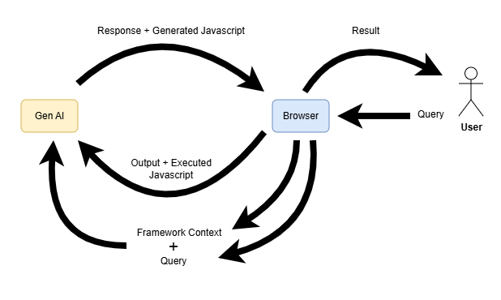

# Cycler

This is a demo using automated iterative cyclic AI code creation with execution feedback.

It's currently setup for communicating with a local Ollama server and gpt-oss:20b.

The interface has three main windows:

*  Prompt: Put your prompt for creating JS code in here.
*  Code: This will display the code generated by the AI chatbot.
*  Conversation: This will show what the chatbot is thinking about + other context.

Click the "Query" button to submit your query to the chatbot.  

# Requirements
*  Requires Ollama installed locally with the server enabled on port 11434.  E.g. you can send API queries to: http://127.0.0.1:11434
*  gpt-oss:20b must be installed

You can change these if you have a different server or model installed.

# How It Works

The prompt is prefixed with some context that describes how the code should be packaged up in the response for execution.  It also includes details about how to process subsequent responses; these contain the results from the evaluations.  It also includes context about how to stop evaluation when it is happy with the result.

Generally you don't need to specify a terminating condition.  It can usually determine if the output was what it expected given the input.  But you can specify success criteria that it will use to determine success.

# Examples

Note: Keep in mind that depending on the model and difficulty of the problem, your success may vary.

## Hello World
*  Prompt: show a js alert that says "Hello World"
*  Expectation: It should make the query and pop up an alert in the browser that says "Hello World"
*  You can see this example's output here: [example_hw](./examples_output/hw)

## Update Text Color
*  Prompt: generate code that finds the html text with the value "Code" and make the element cycle through red, green and blue once a second. Confirm that the text is changing colors by inspecting the actual color of the text.
*  Expectation: The text should change color, and more importantly, code should be generated that independetly validates the color change.
*  Example output: [example_color_change](./examples_output/color)

## Insert Images from External Web Page
*  Prompt: write js code that will find all the images at http://casten.net and then display each bottom of the current web page.  Ensure all images load successfully by checking the bytes retrieved. Ensure when displayed, each image has original dimensions and is visible on the current web page.
*  Expectation: The images should be loaded and be displayed at the end of the current web page.
*  Example output: [example_image_addition](./examples_output/images)

